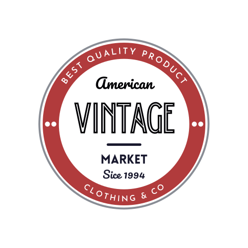
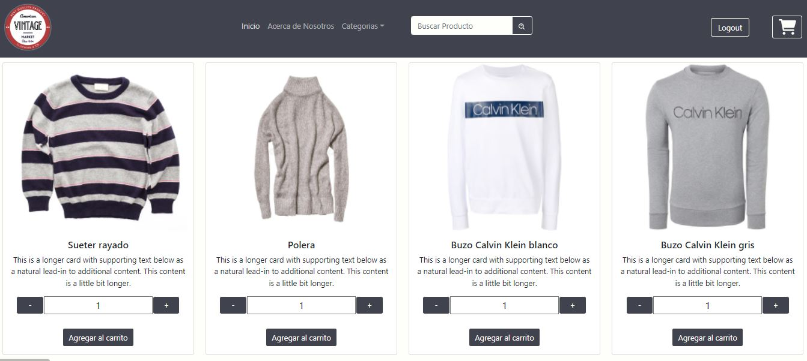
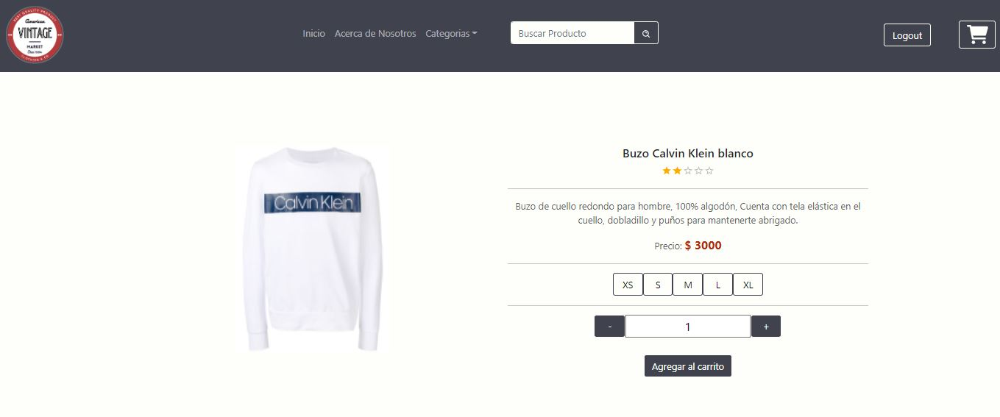

  
    
        
  

  

    Feria Americana Online
  

# E-commerce Varela

E-commerce desarrollado en React, que simboliza una feria americana online, para comercializar ropa usada.

## Demo

[]
---

## Funcionalidad del proyecto

Esta web muestra los productos a la venta. Los usuarios pueden agregar o remover productos de su carrito, donde se especifica la cantidad de cada item, para luego comprarlos.

----------
## Imágenes de la web
----------

*Index*
>
----------

*Detalle de Producto*
>
----------

---

<i class="icon-cog"></i>**##Dependencias del proyecto:**
>  
> - **Mui:** https://mui.com/
> - **React Bootstrap:** https://react-bootstrap.github.io/  <i class="icon-upload"></i>

**<i class="icon-cog"> Navegabilidad / Componentes**
> - [X] Responsive / estilos aplicados de forma estética.
> - [X] Manejo de imágenes.
> - [X] camelCase para eventos.
> - [X] PascalCase para componentes.
> - [X] Routes y Links para navegaciones.
> - [X] Navbar con carrito implementado.
> - [X] Promises y Hooks.

----------

<i>Other places you can find us:</i> 

